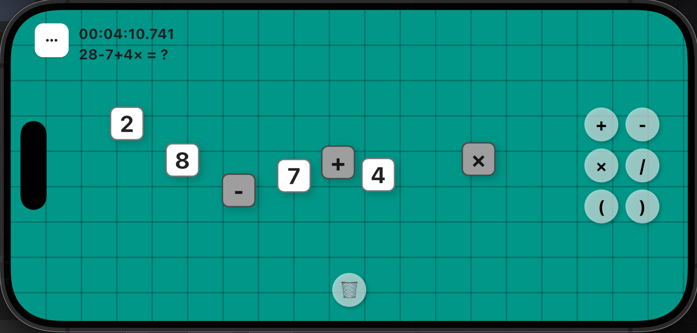

# 🧙 TEN PUZZLE

TEN PUZZLE is a simple puzzle game where you use basic arithmetic to make **10**.

Combine the four given numbers using **addition (+), subtraction (-), multiplication (×), division (÷), and parentheses ()** to form an equation that equals exactly **10**.

**Drag numbers** to arrange them and use the operator buttons to insert symbols.

Every puzzle has a valid solution.

Take your time, think carefully, and enjoy solving each challenge.

A great way to **refresh your mind** during short breaks.

---

## 🎮 How to Play



1. You are given **four random numbers** (e.g., **2, 4, 7, 8**).
2. Use **addition (+), subtraction (-), multiplication (×), division (÷), and parentheses ()** to form an equation.
3. The equation **must equal 10** to solve the puzzle.
4. **Drag numbers and operators** to arrange them correctly.
5. Solve as many puzzles as you can and try to improve your best time!

🂚 **Example:**

```plaintext
(8 + 7) ÷ 5 + 7 = 10
```

---

## 🚀 Installation & Setup

### **📀 Prerequisites**

Before building and running the project, ensure you have:

- **Flutter SDK** installed ([Get Flutter](https://flutter.dev/docs/get-started/install))
- **Dart SDK** (included with Flutter)
- **Android Studio / Xcode** (for Android & iOS builds)

🚨 **Note:** Sound effect files are not included by default.Please download the following files and place them in the `assets/sound` directory:

- [Sound Effect Lab](https://soundeffect-lab.info/)
- [decision4.mp3](https://soundeffect-lab.info/sound/button/mp3/decision4.mp3)
- [decision25.mp3](https://soundeffect-lab.info/sound/button/mp3/decision25.mp3)
- [madness1.mp3](https://soundeffect-lab.info/sound/anime/mp3/madness1.mp3)

---

### **🔧 Run Locally**

1. **Clone the repository**

   ```sh
   git clone https://github.com/kanamoto/tenpuzzle.git
   cd tenpuzzle
   ```

2. **Install dependencies**

   ```sh
   flutter pub get
   ```

3. **Run the app**

#### **📱 For Android**

```sh
flutter build apk
```

#### **🍏 For iOS**

```sh
flutter build ios
flutter run
```

*(For iOS, an Apple Developer account is required to sign the app.)*

---

## 📦 License

This project is licensed under the **MIT License**.See the [`LICENSE`](LICENSE) file for details.

Enjoy the game and happy puzzling! 🎉
